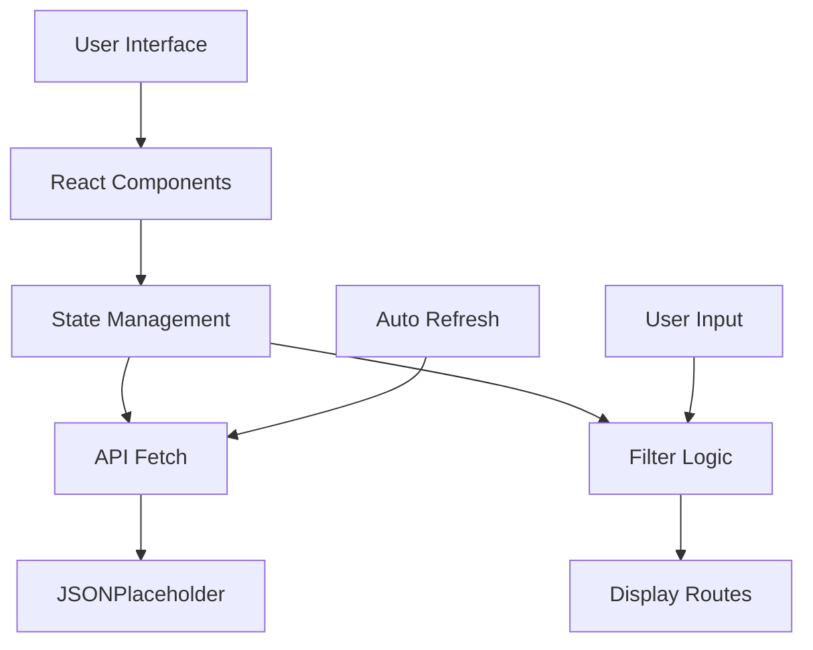
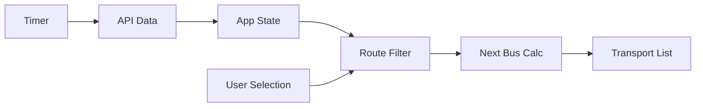
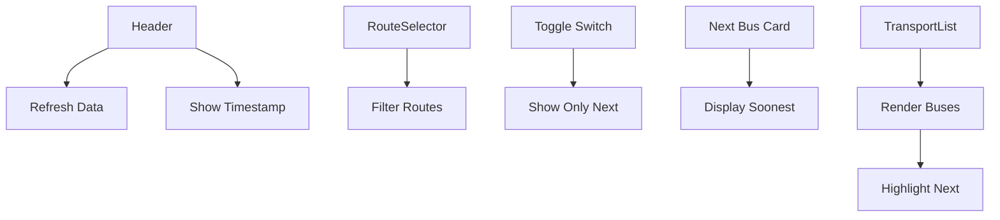

# 🚌 **TransitFlow - Real-Time Bus Tracker** 
### *Smart Public Transport Dashboard*

<div align="center">
  
  
  
  
  
  [](https://your-demo-link.vercel.app)
  
  <h3>⭐ Never Miss Your Bus Again! ⭐</h3>
  
  **[Report Bug](https://github.com/yourusername/transitflow/issues)** •
  **[Request Feature](https://github.com/yourusername/transitflow/issues)** •
  **[View Demo](https://your-demo-link.vercel.app)**

  
  
</div>

## 📋 **Table of Contents**
- [Overview](#overview)
- [Features](#features)
- [Demo](#demo)
- [Tech Stack](#tech-stack)
- [Installation](#installation)
- [Usage](#usage)
- [Project Structure](#project-structure)
- [Screenshots](#screenshots)
- [Flowcharts](#flowcharts)
- [Contributing](#contributing)
- [Author](#author)
- [License](#license)

---

## 📖 **Overview**

TransitFlow is a beautiful, real-time public transport tracking dashboard designed to help commuters track bus arrivals efficiently. With a clean, modern interface and powerful features, TransitFlow combines real-time data updates with smart filtering to ensure you never miss your bus.

> *"Your smart companion for stress-free commuting"* 🚌

<div align="center">
  
</div>

## ✨ **Features**

### 🚏 **Smart Route Management**
- ✅ View all available bus routes
- ✅ Filter buses by specific route numbers
- ✅ Real-time arrival time display
- ✅ Automatic route updates every 30 seconds

### ⏰ **Intelligent Arrival Detection**
- 🎯 **Next Bus Finder** - Automatically detects and highlights the soonest arrival
- 💚 **Visual Highlights** - Green highlighting for next arriving bus
- 📊 **Countdown Timer** - Shows minutes until next arrival
- 🔄 **Auto-refresh** - Data updates every 30 seconds

### 🎨 **User Experience**
- 📱 **Fully Responsive** - Works perfectly on all devices
- 🎪 **Smooth Animations** - Hover effects and transitions
- 🎯 **Focus Mode** - Toggle to show only next arriving bus
- 💫 **Real-time Status** - Live "Last Updated" timestamp
- ⚡ **Manual Refresh** - One-click data update

### 🎛️ **Interactive Controls**
- 📑 **Route Selector** - Dropdown menu for route filtering
- ✅ **Smart Toggle** - Show/hide all buses except next arrival
- 🔘 **Refresh Button** - Instant manual updates
- 🎨 **Visual Feedback** - Color-coded highlights

<div align="center">
  
</div>

## 🚀 **Demo**

| Feature | Live Preview |
|:-------:|:------------:|
| 🌐 **Live Demo** | [transitflow.vercel.app](https://your-demo-link.vercel.app) |
| 📹 **Video Walkthrough** | [Watch Demo](https://youtube.com/your-demo) |

<div align="center">
  
</div>

## 🛠️ **Tech Stack**

<div align="center">
  


</div>

<div align="center">
  
</div>

## 💻 **Installation**

### Prerequisites
```
Node.js (v14.0 or higher)
npm (v6.0 or higher)
Modern web browser
```

### Steps

1. **Clone the repository**
   ```bash
   git clone https://github.com/yourusername/transitflow.git
   ```

2. **Navigate to project directory**
   ```bash
   cd transitflow
   ```

3. **Install dependencies**
   ```bash
   npm install
   ```

4. **Start development server**
   ```bash
   npm start
   ```

5. **Open in browser**
   ```
   http://localhost:3000
   ```

### Quick Start
```bash
# One-liner setup
git clone https://github.com/yourusername/transitflow.git && cd transitflow && npm install && npm start
```

<div align="center">
  
</div>

## 📖 **Usage**

### Getting Started
1. Open the dashboard in your browser
2. View all available bus routes with arrival times
3. Check the "Next Bus" card for the soonest arrival
4. Use dropdown to filter specific routes
5. Toggle "Show only next arriving" for focused view

### Key Features in Action

| Feature | How to Use | Benefit |
|:-------:|:----------:|:-------:|
| 🚏 **Route Filter** | Click dropdown + select route | Find specific bus quickly |
| ⏰ **Next Bus Card** | Automatically displayed at top | See soonest arrival instantly |
| 💚 **Highlight** | Next bus automatically green | Visual priority identification |
| 🔄 **Refresh** | Click refresh button or wait 30s | Always accurate data |
| 🎯 **Focus Mode** | Toggle checkbox | Reduce visual clutter |

<div align="center">
  
</div>

## 📁 **Project Structure**

```
transitflow/
│
├── 📂 src/
│   ├── 📂 components/
│   │   ├── 📄 Header.js          # Title, timestamp & refresh button
│   │   ├── 📄 RouteSelector.js    # Dropdown filter component
│   │   └── 📄 TransportList.js    # Bus list with highlights
│   │
│   ├── 📄 App.js                  # Main logic & state management
│   └── 📄 App.css                  # All styles & animations
│
├── 📄 package.json                 # Dependencies & scripts
├── 📄 README.md                    # Documentation
└── 📄 .gitignore                   # Git ignore rules
```

<div align="center">
  
</div>

## 📸 **Screenshots**

<div align="center">
  <table>
    <tr>
      <td align="center">
        
        <br/>
        <sub><b>📊 Main Dashboard</b></sub>
      </td>
      <td align="center">
        
        <br/>
        <sub><b>⏰ Next Bus Detection</b></sub>
      </td>
    </tr>
    <tr>
      <td align="center">
        
        <br/>
        <sub><b>🔍 Route Filter View</b></sub>
      </td>
      <td align="center">
        
        <br/>
        <sub><b>📱 Mobile Experience</b></sub>
      </td>
    </tr>
  </table>
</div>

<div align="center">
  
</div>

## 🔄 **Flowcharts**

### System Architecture


### Data Flow


### Feature Interaction


<div align="center">
  
</div>

## 🤝 **Contributing**

We welcome contributions! Here's how you can help:

1. 🍴 **Fork** the repository
2. 🌿 Create a **feature branch**
   ```bash
   git checkout -b feature/AmazingFeature
   ```
3. 💾 **Commit** your changes
   ```bash
   git commit -m 'Add some AmazingFeature'
   ```
4. 📤 **Push** to the branch
   ```bash
   git push origin feature/AmazingFeature
   ```
5. 🎯 Open a **Pull Request**

### Development Guidelines
- ✅ Follow existing code style
- ✅ Add comments for complex logic
- ✅ Test thoroughly before submitting
- ✅ Update documentation if needed

### Future Enhancements Planned
- [ ] 🗺️ **Live Map Integration**
- [ ] 🔔 **Push Notifications**
- [ ] 📍 **GPS Tracking**
- [ ] 🌙 **Dark Mode**
- [ ] 📱 **PWA Support**
- [ ] 🌍 **Multi-language Support**
- [ ] 📊 **Route History**
- [ ] 💾 **Favorite Routes**


### *"Your journey, simplified. Your time, optimized."* ✨

**Made with ❤️ for better public transport experience**

<br/>

| ⭐ **Star** | 🐛 **Report Bug** | 💡 **Suggest Feature** |
|:---:|:---:|:---:|
| [](https://github.com/yourusername/transitflow/stargazers) | [](https://github.com/yourusername/transitflow/issues) | [](https://github.com/yourusername/transitflow/issues) |

</div>

---

<div align="center">
  
**Quick Links 🔗**
- [Report Bug](https://github.com/yourusername/transitflow/issues)
- [Request Feature](https://github.com/yourusername/transitflow/issues)
- [View Documentation](https://github.com/yourusername/transitflow#readme)
- [View Demo](https://your-demo-link.vercel.app)

</div>

## ❓ **FAQ**

| Question | Answer |
|:--------:|:------:|
| **Q: Does TransitFlow require internet connection?** | A: Yes, it needs internet to fetch real-time data from the API. |
| **Q: How often does data refresh?** | A: Data automatically refreshes every 30 seconds. |
| **Q: Can I use TransitFlow on mobile?** | A: Yes! TransitFlow is fully responsive and works on all devices. |
| **Q: Is TransitFlow free?** | A: Yes, completely free and open source! |
| **Q: Can I add my city's transport data?** | A: Yes, simply update the API endpoint in the code. |
| **Q: How accurate are the arrival times?** | A: With real API integration, times can be as accurate as the data source. |

---

<div align="center">
  <sub>© 2024 TransitFlow. All rights reserved.</sub>
  <br/>
  <sub>Made with ⚛️ React and ❤️</sub>
</div>

